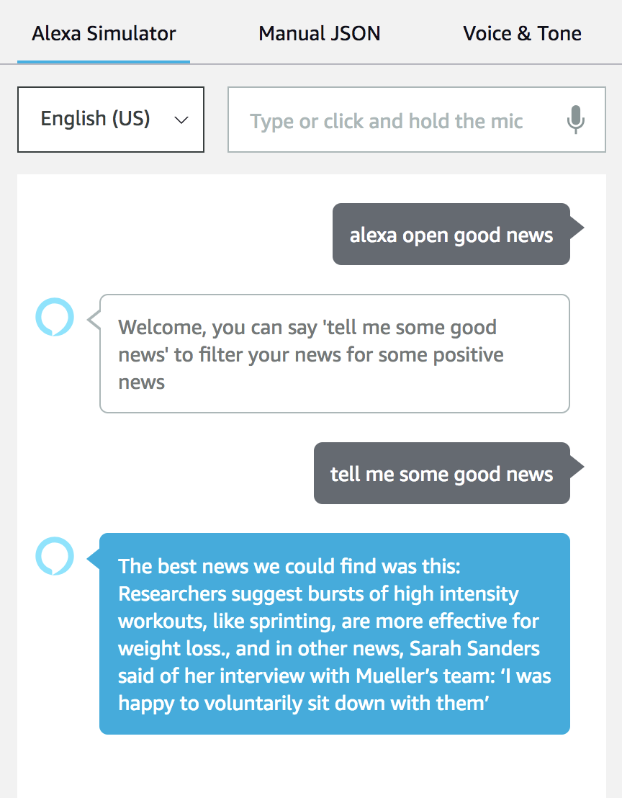
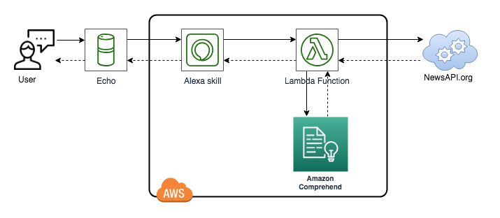

Alexa skill for Good News
=========================

Get Some Good News
------------------
Ask Alexa for some good news, and it will tell you the top two most positive headlines it can find from the news.

The news article descriptions are sourced from BBC News, Google News UK and The Guardian UK - this API is operated under the free tier of [NewsAPI.org](https://newsapi.org) and depends on an environment variable called `newsApiKey` to be passed in to the Lambda function.

Sentiment analysis by AWS Comprehend is used to sort news article descriptions by positivity: don't expect miracles here, it's still mostly doom & gloom...

The resulting project is deployed as an Alexa skill in testing mode [not globally published] so requires a device assocaited with a developer account or use of the Alexa simulator.

How do I use the skill?
------------------
* This project is based on the AWS CodeStar project sample for NodeJS Alexa Skills development.  It provisions a sample Alexa skill that uses the custom interaction model, an AWS Lambda function, and an AWS CodePipeline continuous integration/continuous delivery (CI/CD) pipeline.
* Test the 'good news' skill in the Alexa Simulator. From your AWS CodeStar project dashboard, choose the Alexa Simulator button. You can also go to the [Alexa Skills Kit developer console](https://developer.amazon.com/alexa/console/ask), select your skill, and choose the Test tab. Enable testing and type or say, "Open good news" or "tell me some good news".
* Once the skill is enabled in the Alexa Simulator, it can also be invoked on an Alexa enabled device which is registered with your Amazon developer account.
* To extend the skill with additional interactions, read the documentation for [Alexa Skills Kit](https://developer.amazon.com/docs/quick-reference/custom-skill-quick-reference.html) and the [ASK SDK](https://developer.amazon.com/docs/quick-reference/use-sdks-quick-reference.html).

NOTE: As per the AWS CodeStar sample setup, you should only make edits to the Lambda function in the repository and push to deploy changes. In order to make changes to the Alexa skill invocation model, you will need to overwrite the JSON model in the Build tab in the ASK developer console, then select 'Build Model'. The CodeStar example pipeline will only automatically deploy changes to the Lambda function, not changes to the Alexa skill invocation model.

Additional dependency: the CodeStar permissions boundary IAM policy must be changed to add ComprehendFullAccess, so the lambda execution role can be granted additional permissions to use Amazon Comprehend in the CloudFormation template.
